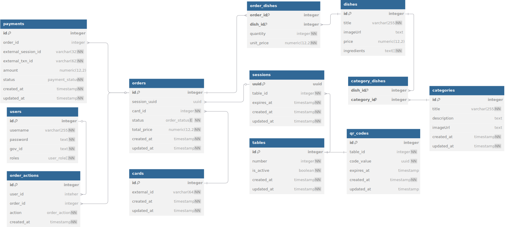

# Content

- [Content](#content)
- [Project Overview](#project-overview)
- [Technology Stack](#technology-stack)
- [Backend Overview](#backend-overview)
- [API Endpoints](#api-endpoints)
- [Frontend Overview](#frontend-overview)
- [Deployment to AWS](#deployment-to-aws)

# Project Overview

## Project Description

This system enables end users at the food court to:

1. **Browse a structured menu** of categories and dishes.
2. **Place an order** by selecting items and specifying quantities.
3. **Pay** using their corporate food card via a secure food card web service integration.

In parallel, a suite of **back office APIs** allows food court managers to:

- **Create, update, and delete** menu categories and dishes.
- **View, approve, reject, and track** incoming orders.
- **Issue refunds** when orders are rejected.

A complementary **user interface** will guide customers through browsing menu items, placing orders, and completing payments.

## Bonus Features

- **Menu Categories**: Organize dishes into logical groups (e.g., Breakfast, Lunch, Dinner). This improves user navigation by reducing choice overload and potentially lets managers update related items in bulk.

- **Session Management**: Each QR scan initiates a session linked to a specific table and timestamp. Sessions are designed with a time-to-live (TTL) and a maximum number of orders to ensure proper mapping of orders to tables, support automatic expiration, and prevent misuse. If the maximum number of orders is exceeded, users will be prompted to start a new session.

## Business Recommendations

- **Dynamic QR Rotation**: Generate QR codes with rotating short-lived tokens or refresh them at set intervals (e.g., hourly) to prevent unauthorized reuse or cloning.
  The backend should validate token freshness on scan and reject expired codes.

# Technology Stack

## Monorepository

The monorepository structure gathers shared resources: type definitions, DTOs, and some business logic under a single source of truth.
It uses Yarn Workspaces to manage dependencies.
Two primary folders are declared:

- `apps` for application code (front-end and back-end apps)
- `packages` for reusable code (types, DTOs, utilities)

## Frontend

**React** is used for the customer-facing SPA due to its component-based architecture. This enables the creation of reusable UI components, such as menu lists and order carts.

**React Query** simplifies data fetching and caching for the backend endpoints. It ensures minimal loading states and automatic data synchronization.

**React Router** provides declarative routing for multi-page flows, supporting menu browsing, order review, and payment redirect within the single-page app.

**Zustand** provides lightweight state management with a simple API. It's used for managing the shopping cart state, user selections, and UI interactions without the boilerplate of larger state libraries.

**Tailwind CSS** enables rapid UI development through utility classes. This approach reduces custom CSS overhead, ensures consistent styling across components, and simplifies responsive design implementation.

## Backend

**NestJS** structures the server into modules like Sessions, Dishes, Orders, and Payments. It utilizes built-in dependency injection, decorators, and guards, promoting clean separation of concerns and testable services.

**Fastify Adapter** replaces the default HTTP server in NestJS to achieve high request throughput and low latency.

**TypeORM** maps TypeScript entities to database tables and provides migrations for schema evolution. It simplifies complex relations, such as Order - OrderActions, with decorator-based definitions. Additionally, TypeORM can handle raw SQL requests, offering flexibility for complex queries.

## Database

**PostgreSQL** serves as the primary data store: as a relational database it enforces strict schemas, ACID-compliant transactions, and foreign-key constraints to guarantee data integrity across business entities.
PostgreSQL in particular is chosen for its well-setup ecosystem, concurrency model, and rich indexing options.

**Redis** is used for caching frequently requested data, such as menu items and categories, with configurable time-to-live (TTL) values. This reduces database load and improves response times for common requests.
Additionally, Redis is utilized for implementing a throttler to manage request rate limiting.

## Deployment and Hosting

**Amazon Web Services (AWS)** is used for deploying and hosting the applications, utilizing its robust infrastructure and scalability features.

AWS was chosen for its global, secure, scalable infrastructure combined with a comprehensive suite of managed services, and efficient cost-management.

### Key AWS Services Used:

- Amazon ECS
- Amazon RDS
- Amazon ECR

# Backend Overview

## Architecture

The backend is a **modular monolith** built with NestJS. The features are split into modules
(sessions, categories, dishes, orders, payments) and share services using dependency injection.
This makes deployment and testing simple, and later it's possible to turn **each module into a microservice** if needed.

**Caching** in Redis speeds up data retrieval and reduces database load, while **throttling** manages request rates to prevent abuse, ensuring efficient system performance.

## Example: Module Folder Structure

For each domain module (e.g., `sessions`, `dishes`), the folder layout looks like:

```
<module>/
├── constants/
│
├── services/                         # business logic services (optional)
│   ├── <module>.service.ts
│   └── <module>.service.spec.ts      # unit tests for the service
│
├── repository                        # data access logic (optional)
│   ├── <module>.repository.ts
│   └── <module>.repository.spec.ts   # unit tests for the repository
│
├── <module-entity>.entity.ts         # TypeORM entity definitions
├── <module>.controller.ts            # controller with route handlers (optional)
├── <module>.controller.spec.ts       # unit tests for the controller (optional)
└── <module>.module.ts                # NestJS module definition and imports/exports
```

## Database Design

Below is the core relational model for the system. Entities and their relationships are defined in PostgreSQL, with an ER diagram illustrating tables and foreign keys:



## Running locally

To run the backend application locally, you can use Docker or Yarn commands as defined in the `apps/server/package.json`.

### Using Docker

1. **Build and run the Docker Images**:

```bash
yarn docker:build
```

2. **Or with previously built images, start the Docker Containers**:

```bash
yarn docker:up
```

This will set up the backend along with PostgreSQL and Redis containers as specified in the `apps/server/docker-compose.yml` file.

### Using Yarn

1. **Install Dependencies**:

```bash
yarn install
```

2. **Start the Development Server**:

```bash
yarn start:dev
```

These commands will start the NestJS server, and you can access it on the default port. Note that this setup does not include PostgreSQL and Redis, so you will need to configure and connect to them manually.

# API Endpoints

This section outlines all public and protected API endpoints, their methods, required headers, request/response schemas, and possible error codes.

> **Note on GraphQL vs. REST:**
>
> GraphQL would be the preferable approach for handling order requests, as it queries nested or filtered data (e.g., fetches orders with pagination, status filters, and action history in a single request) more efficient.
>
> However, this documentation uses a REST-based approach to satisfy the test assignment requirements.

---

## Common Headers

| Header          | Required For     | Description                                           |
| --------------- | ---------------- | ----------------------------------------------------- |
| `X-Session-Id`  | Public endpoints | UUID session token obtained from `POST /api/sessions` |
| `Authorization` | Admin endpoints  | Bearer JWT for admin authentication: `Bearer <JWT>`   |

---

## Public Endpoints (Client Journey)

### 1. Create Session

**Endpoint**: `POST /api/sessions`

```
Content-Type:  application/json
```

**Description**: Initialize a new user session when redirected via the link obtained by scanning a table QR code. Returns a session UUID, table number, expiry timestamp, and the menu (object with categories and dishes).

**Request Body (application/json)**:

```json
{
  "codeValue": "<uuid from QR code>"
}
```

**Success Response**: `201 Created`

```json
{
  "id": "550e8400-e29b-41d4-a716-446655440000",
  "tableNumber": 7,
  "expiresAt": "2025-04-18T17:30:00Z",
  "createdAt": "2025-04-19T20:00:00Z",
  "updatedAt": "2025-04-19T20:00:00Z",
  "categories": [
    {
      "id": 1,
      "title": "Dinner",
      "dishes": [
        {
          "id": 1,
          "name": "Pizza",
          "price": 10,
          "description": "A delicious pizza with cheese and tomato sauce"
        }
      ]
    }
  ]
}
```

**Error Responses**:

- `400 Bad Request` - invalid or missing `codeValue`
- `404 Not Found` - QR code not found or expired

---

### 2. Get Menu (Optional)

**Endpoint**: `GET /api/categories?include=dishes`

**Description**: Retrieve a menu object. The menu data can also be stored from the initial session creation response (`POST /api/sessions`).

**Headers**:

```
X-Session-Id:  <session-uuid>
```

**Query Parameters**:

- `include` (required): Comma-separated list of related entities to include in the response. For this endpoint, set it to `dishes` to return each category along with its dishes. Example: `?include=dishes`

**Success Response**: `200 OK`

```json
{
  "categories": [
    {
      "id": 1,
      "title": "Dinner",
      "imageUrl": "https://example.com/images/dinner.png",
      "createdAt": "2025-04-19T20:00:00Z",
      "updatedAt": "2025-04-19T20:00:00Z",
      "dishes": [
        {
          "id": 1,
          "name": "Pizza",
          "price": 10,
          "description": "A delicious pizza with cheese and tomato sauce",
          "createdAt": "2025-04-19T20:00:00Z",
          "updatedAt": "2025-04-19T20:00:00Z"
        }
      ]
    }
  ]
}
```

**Error Responses**:

- `401 Unauthorized` - invalid or missing `X-Session-Id`

---

### 3. Get card balance

**Endpoint**: `POST /api/cards/balance`

**Description**: Retrieve the current balance of the corporate card by its token.

**Headers**:

```
Content-Type:  application/json
X-Session-Id:  <session-uuid>
```

**Request Body (application/json)**:

```json
{
  "cardToken": "<card-token>"
}
```

**Success Response**: `200 OK`

```json
{
  "balance": 45.5
}
```

**Error Responses**:

- `400 Bad Request` - invalid or missing `cardToken`.
- `401 Unauthorized` - invalid or missing `X-Session-Id`.
- `404 Not Found` - card not found with the web service.

---

### 4. Create Order

**Endpoint**: `POST /api/orders`

**Description**: Create a new order in the database using the specified cart items. Returns the created order ID.

**Headers**:

```
Content-Type:  application/json
X-Session-Id:  <session-uuid>
```

**Request Body (application/json)**:

```json
{
  "cart": [
    {
      "dishId": 27,
      "quantity": 2
    }
  ]
}
```

**Success Response**: `201 Created`

```json
{
  "id": 881,
  "status": "pending",
  "totalPrice": 15.0,
  "createdAt": "2025-04-19T20:00:00Z",
  "updatedAt": "2025-04-19T20:00:00Z",
  "items": [
    {
      "dishId": 27,
      "quantity": 2,
      "unitPrice": 7.5
    }
  ],
  "actions": []
}
```

**Error Responses**:

- `400 Bad Request` - invalid or missing `cart`.
- `401 Unauthorized` - invalid or missing `X-Session-Id`.
- `402 Payment Required` - insufficient card balance.
- `404 Not Found` - one or more dishes in the cart not found.

### 5. Initiate Payment

**Endpoint**: `POST /api/payments`

**Description**: Check the card balance with the food card web service; if sufficient, generate a payment request for an existing order and return a redirect URL for user confirmation.

**Headers**:

```
Content-Type:  application/json
X-Session-Id:  <session-uuid>
```

**Request Body (application/json)**:

```json
{
  "orderId": 881,
  "cardToken": "<card-token>"
}
```

**Success Response**: `201 Created`

```json
{
  "paymentId": "pay-abc123",
  "redirectUrl": "https://payment.example.com/pay?session=xyz"
}
```

**Error Responses**:

- `400 Bad Request` - invalid or missing parameters.
- `401 Unauthorized` - invalid or missing `X-Session-Id`.
- `402 Payment Required` - insufficient card balance.
- `404 Not Found` - order not found.

---

### 6\*. Payment Callback

**Endpoint**: `POST /api/payments/callback`

**Description**: Webhook endpoint for food card web service notifications. Update order status and record transaction details.

**Headers**:

```
Content-Type:              application/json
X-Card_Service-Signature:  <HMAC-SHA256 signature>
```

**Request Body (application/json)**:

```json
{
  "paymentId": "paym-abcdef123456",
  "status": "success", // or "failed"
  "transactionId": "txn-7890ghijk",
  "authorizedAmount": 15.0,
  "timestamp": "2025-04-19T20:15:30Z"
}
```

**Success Response**: `200 OK`

```json
{ "result": "accepted" }
```

**Error Responses**:

- `400 Bad Request` - invalid payload.
- `401 Unauthorized` - invalid signature.
- `409 Conflict` - duplicate notification.

---

### 7. List Session Orders

**Endpoint**: `GET /api/sessions/orders`

**Description**: Retrieve a list of the session's orders sorted by createdAt.

**Headers**:

```
X-Session-Id:  <session-uuid>
```

**Query Parameters**:

```
?status=pending,approved
```

**Success Response**: `200 OK`

```json
{
  "orders": [
    {
      "id": 15,
      "status": "pending",
      "totalPrice": 15.0,
      "createdAt": "2025-04-19T20:00:00Z",
      "updatedAt": "2025-04-19T20:00:00Z"
    }
  ]
}
```

**Error Responses**:

- `401 Unauthorized` - invalid or missing `X-Session-Id`

---

### 8. Get Session Order Details

**Endpoint**: `GET /api/sessions/orders/{id}`

**Headers**:

```
X-Session-Id:  <session-uuid>
```

**Description**: Retrieve detailed information about a specific session order with order actions.

**Path Parameters**:

- `id` - The ID of the order.

**Success Response**: `200 OK`

```json
{
  "id": 15,
  "status": "approved",
  "totalPrice": 15.0,
  "createdAt": "2025-04-19T20:00:00Z",
  "updatedAt": "2025-04-19T20:00:00Z",
  "items": [
    {
      "dishId": 1,
      "quantity": 2,
      "unitPrice": 7.5
    }
  ],
  "actions": [
    { "id": 19, "action": "approved", "createdAt": "2025-04-19T20:00:00Z" }
  ]
}
```

**Error Responses**:

- `401 Unauthorized` - invalid or missing `X-Session-Id`.
- `404 Not Found` - order not found in this session.

---

## Protected Endpoints (Admin Role / Backoffice)

All backoffice endpoints, except for authentication, require:

```
Authorization:  Bearer <JWT>
```

and will reject requests with `401 Unauthorized` if the JWT is invalid or missing or the user lacks the `admin` role.

---

## 0. Authentication

### 0.1. Login

**Endpoint**: `POST /api/auth/login`

**Description**: Authenticate a user and return a JWT along with user.

**Headers**:

```
Content-Type: application/json
```

**Request Body (application/json)**:

```json
{
  "username": "<username>",
  "password": "<password>"
}
```

**Success Response**: `200 OK`

```json
{
  "user": {
    "id": 1,
    "username": "username",
    "roles": ["admin"],
    "govId": "9090-2932-...",
    "fullName": "Stepan Radchenko"
  },
  "accessToken": "ey..."
}
```

**Error Responses**:

- `400 Bad Request` - missing or invalid parameters.
- `401 Unauthorized` - invalid credentials.

### 0.2. Logout

**Endpoint**: `POST /api/auth/logout`

**Description**: Logout a user by invalidating their JWT. The token is added to the Redis blacklist to prevent further use until it expires.

**Headers**:

```
Authorization: Bearer <JWT>
```

**Success Response**: `204 No Content`

(No response body)

**Error Responses**:

- `401 Unauthorized` - invalid or missing JWT.

## 1. Category Management

### 1.1 List Categories

**Endpoint**: `GET /api/categories`

**Description**: Retrieve a list of all available categories.

**Headers**:

```
Authorization:  Bearer <JWT>
```

**Query Parameters**:

- `include` (optional): Comma-separated list of related entities to include in the response. Supported values: `dishes`. Example: `?include=dishes`

**Success Response**: `200 OK`

```json
{
  "categories": [
    {
      "id": 1,
      "title": "Lunch",
      "description": "A selection of lunch items",
      "imageUrl": "https://example.com/images/lunch.png",
      "createdAt": "2025-04-19T20:00:00Z",
      "updatedAt": "2025-04-19T20:00:00Z"
    },
    {
      "id": 2,
      "title": "Breakfast",
      "description": "Start your day with our breakfast options",
      "imageUrl": "https://example.com/images/breakfast.png",
      "createdAt": "2025-04-19T20:00:00Z",
      "updatedAt": "2025-04-19T20:00:00Z"
    }
  ]
}
```

**Error Responses**:

- `401 Unauthorized` - invalid or missing JWT.

### 1.2 Create Category

**Endpoint**: `POST /api/categories`

**Headers**:

```
Content-Type:  application/json
Authorization:  Bearer <JWT>
```

**Request Body (application/json)**:

```json
{
  "title": "Breakfast",
  "description": "A brief description of this category", // optional
  "imageUrl": "https://example.com/images/breakfast.png" // optional
}
```

**Success Response**: `201 Created`

```json
{
  "id": 2,
  "title": "Breakfast",
  "description": "A brief description of this category",
  "imageUrl": "https://example.com/images/breakfast.png",
  "createdAt": "2025-04-19T20:00:00Z",
  "updatedAt": "2025-04-19T20:00:00Z"
}
```

**Error Responses**:

- `400 Bad Request` - invalid or missing parameters.
- `401 Unauthorized` - invalid or missing JWT.

### 1.3. Update Category

**Endpoint**: `PATCH /api/categories/{id}`

**Description**: Update an existing category.

**Headers**:

```
Content-Type:  application/json
Authorization:  Bearer <JWT>
```

**Path Parameters**:

- `id` - ID of the category.

**Request Body (application/json)**: All fields are optional, but at least one field must be provided.

```json
{
  "title": "Brunch",
  "description": "Updated description",
  "imageUrl": "https://example.com/images/brunch.png"
}
```

**Success Response**: `200 OK`

```json
{
  "id": 2,
  "title": "Brunch",
  "description": "Updated description",
  "imageUrl": "https://example.com/images/brunch.png",
  "createdAt": "2025-04-19T20:00:00Z",
  "updatedAt": "2025-04-19T20:00:00Z"
}
```

**Error Responses**:

- `400 Bad Request` - invalid parameters.
- `401 Unauthorized` - invalid or missing JWT.
- `404 Not Found` - category not found.

### 1.4 Delete Category

**Endpoint**: `DELETE /api/categories/{id}`

**Description**: Delete a category.

**Headers**:

```
Authorization:  Bearer <JWT>
```

**Path Parameters**:

- `id` - ID of the dish.

**Success Response**: `204 No Content`

**Error Responses**:

- `401 Unauthorized` - invalid or missing JWT.
- `404 Not Found` - category not found.

---

## 2. Dish Management

### 2.1 Create Dish

**Endpoint**: `POST /api/dishes`

**Headers**:

```
Content-Type:  application/json
Authorization:  Bearer <JWT>
```

**Request Body (application/json)**:

```json
{
  "title": "Omelette",
  "price": 5.0,
  "categoryIds": [1, 3], // optional
  "description": "Fluffy eggs with cheese", // optional
  "ingredients": ["Eggs", "Cheese", "Milk", "Salt", "Pepper", "Butter"] // optional
}
```

**Success Response**: `201 Created`

```json
{
  "id": 1,
  "title": "Omelette",
  "price": 5.0,
  "description": "Fluffy eggs with cheese",
  "ingredients": ["Eggs", "Cheese", "Milk", "Salt", "Pepper", "Butter"],
  "createdAt": "2025-04-19T20:00:00Z",
  "updatedAt": "2025-04-19T20:00:00Z",
  "categories": [
    // if `categoryIds` is set in the request body
    {
      "id": 1,
      "title": "Breakfast",
      "description": "A brief description of this category",
      "imageUrl": "https://example.com/images/breakfast.png",
      "createdAt": "2025-04-19T20:00:00Z",
      "updatedAt": "2025-04-19T20:00:00Z"
    },
    {
      "id": 3,
      "title": "Brunch",
      "description": "A brief description of this category",
      "imageUrl": "https://example.com/images/brunch.png",
      "createdAt": "2025-04-19T20:00:00Z",
      "updatedAt": "2025-04-19T20:00:00Z"
    }
  ]
}
```

**Error Responses**:

- `400 Bad Request` - invalid or missing parameters.
- `401 Unauthorized` - invalid or missing JWT.
- `404 Not Found` - category(-ies) not found.

### 2.2. Update Dish

**Endpoint**: `PATCH /api/dishes/{id}`

**Description**: Update an existing dish.

**Headers**:

```
Content-Type:  application/json
Authorization:  Bearer <JWT>
```

**Path Parameters**:

- `id` - ID of the dish.

**Request Body (application/json)**: All fields are optional, but at least one field must be provided.

```json
{
  "title": "Updated title",
  "price": 25.0,
  "categoryIds": [1], // category removed
  "description": "Updated description",
  "ingredients": ["Eggs", "Milk - 200ml", "New Ingredient"]
}
```

**Success Response**: `200 OK`

```json
{
  "id": 3,
  "title": "Updated title",
  "price": 25.0,
  "description": "Updated description",
  "ingredients": ["Eggs", "Milk - 200ml", "New Ingredient"],
  "categories": [
    // if `categoryIds` is set in the request body
    {
      "id": 1,
      "title": "Breakfast",
      "description": "A brief description of this category",
      "imageUrl": "https://example.com/images/breakfast.png",
      "createdAt": "2025-04-19T20:00:00Z",
      "updatedAt": "2025-04-19T20:00:00Z"
    }
  ]
}
```

**Error Responses**:

- `400 Bad Request` - invalid parameters.
- `401 Unauthorized` - invalid or missing JWT.
- `404 Not Found` - dish or category not found.

### 2.3. Delete Dish

**Endpoint**: `DELETE /api/dishes/{id}`

**Description**: Delete a dish.

**Headers**:

```
Authorization:  Bearer <JWT>
```

**Path Parameters**:

- `id` - ID of the dish.

**Success Response**: `204 No Content`

**Error Responses**:

- `401 Unauthorized` - invalid or missing JWT.
- `404 Not Found` - dish not found.

---

## 3. Order Fetching

All fetching multiple orders endpoints support query parameters:

- `status` (optional): array of statuses. You can pass multiple values as comma-separated (`?status=pending,approved`).
- `page` (optional): page number (default `1`).
- `limit` (optional): items per page (default `20`).
- `sortBy` (optional): field to sort (e.g., `createdAt`, `totalPrice`).
- `order` (optional): `asc` or `desc` (default `desc`).
- `include` (optional): Comma-separated list of related entities to include in the response. Supported values: `actions`. Example: `?include=actions`.

### 3.1 List Orders

**Endpoint**: `GET /api/orders`

**Description**: Retrieve a paginated list of orders, with optional filters and history.

**Headers**:

```
Authorization:  Bearer <JWT>
```

**Query Parameters**:

```
?status=pending
&page=2
&limit=10
&sortBy=createdAt
&order=asc
&include=actions
```

**Success Response**: `200 OK`

```json
{
  "page": 2,
  "limit": 10,
  "orders": [
    {
      "id": 22,
      "status": "approved",
      "totalPrice": 15.0,
      "createdAt": "2025-04-19T20:00:00Z",
      "updatedAt": "2025-04-19T20:00:00Z",
      "actions": [
        { "id": 19, "action": "approve", "createdAt": "2025-04-19T20:00:00Z" }
      ]
    }
  ]
}
```

**Error Responses**:

- `400 Bad Request` - invalid query parameters.
- `401 Unauthorized` - invalid or missing JWT.

---

### 3.2 Get Order Details

**Endpoint**: `GET /api/orders/{id}`

**Description**: Retrieve a single order, with optional action history.

**Headers**:

```
Authorization:  Bearer <JWT>
```

**Path Parameters**:

- `id` - ID of the order.

**Query Parameters**:

- `include` (optional): Comma-separated list of related entities to include in the response. Supported value: `actions`.

**Success Response**: `200 OK`

```json
{
  "id": 15,
  "sessionUuid": "a1b2c3d4-e5f6-7890-abcd-ef1234567890",
  "cardId": 19,
  "status": "pending",
  "totalPrice": 15.0,
  "createdAt": "2025-04-19T20:00:00Z",
  "updatedAt": "2025-04-19T20:00:00Z",
  "items": [{ "dishId": 1, "quantity": 2, "unitPrice": 7.5 }],
  "actions": []
}
```

**Error Responses**:

- `401 Unauthorized` - invalid or missing JWT.
- `404 Not Found` - order not found.

---

## 4. Order Actions

### 4.1 Approve Order

**Endpoint**: `POST /api/orders/{id}/approve`

**Description**: Approve a pending order and finalize payment (capture funds).

**Headers**:

```
Authorization:  Bearer <JWT>
```

**Path Parameters**:

- `id` - ID of the order.

**Success Response**: `200 OK`

```json
{
  "id": 27,
  "sessionUuid": "a1b2c3d4-e5f6-7890-abcd-ef1234567890",
  "cardId": 88,
  "status": "approved",
  "totalPrice": 15.0,
  "createdAt": "2025-04-19T20:00:00Z",
  "updatedAt": "2025-04-19T20:00:00Z",
  "items": [{ "dishId": 1, "quantity": 2, "unitPrice": 7.5 }]
}
```

**Error Responses**:

- `401 Unauthorized` - invalid or missing JWT.
- `402 Payment Required` - capture failed.
- `404 Not Found` - order not found.

---

### 4.2 Reject Order

**Endpoint**: `POST /api/orders/{id}/reject`

**Description**: Reject a pending order and trigger a refund (release funds).

**Headers**:

```
Authorization:  Bearer <JWT>
```

**Path Parameters**:

- `id` - ID of the order.

**Success Response**: `200 OK`

```json
{
  "id": 28,
  "sessionUuid": "a1b2c3d4-e5f6-7890-abcd-ef1234567890",
  "cardId": 20174,
  "status": "rejected",
  "totalPrice": 15.0,
  "createdAt": "2025-04-19T20:00:00Z",
  "updatedAt": "2025-04-19T20:00:00Z",
  "items": [{ "dishId": 1, "quantity": 2, "unitPrice": 7.5 }]
}
```

**Error Responses**:

- `401 Unauthorized` - invalid or missing JWT.
- `404 Not Found` - order not found.
- `409 Conflict` - refund already processed.

# Frontend Overview

The folder structure can be found under `apps/client/src`

## Architecture

A **modified modular architecture** is adopted for the frontend: each business domain lives under `modules/` (e.g., `cards`, `cart`, `orders`, `dishes`) and exposes its public API through an `index.ts` file.
Modules can reference each other, but all imports follow a unidirectional flow to maintain clear responsibility and eliminate circular dependencies.

All top-level pages are defined in the **`screens/`** folder, where each screen composes parts from domain modules.
If a screen needs specific UI components, it may include its own `components/` subfolder for local using.

For any combined-domain features that use multiple modules, it's possible to extract those into a dedicated **`templates/`** folder.
This ensures separation of concerns and eliminates circular dependencies.

## Example: Module Folder Structure

```
modules/
└─ <module>/
   ├─ api/
   │   ├─ <module>.api.ts          # axios requests
   │   ├─ <module>.queries.ts      # react-query hooks
   │   └─ index.ts                 # export public API
   │
   ├─ components/
   │   └─ component-1/
   │       ├─ component-1.tsx      # JSX
   │       ├─ component-1.state.ts # local hook
   │       ├─ component-1.test.tsx
   │       ├─ component-1.state.test.ts
   │       └─ index.ts             # export component-1
   │
   ├─ hooks/        # (optional) custom hooks
   ├─ store/        # (optional) zustand store files
   ├─ utils/        # (optional) helper functions (with test)
   ├─ constants/    # (optional)
   ├─ types/        # (optional) type definitions
   └─ index.ts      # barrel for public exports
```

## Shared Module

`src/shared/` contains:

- `ui/` - atomic components (`button`, `selector`)
- `api/api.client.ts` - single axios instance with interceptors (adds session ID header, handles 401)
- `hooks/` - generic hooks (`useDebounce`, `useTimeout`)
- `utils/` - pure helpers (`formatPrice`)

## State Management

**Zustand** for client state:

- **Cart** persisted via `persist` middleware so it survives reloads.

- **Menu data** (dishes by category) in a store loaded once at startup.

## Session Handling

- **Session ID** stored in `localStorage` under `"sessionId"`.
- **Session ID Retrieval** is optimized via a caching mechanism to minimize direct `localStorage` access.
- Shared axios client automatically reads the cached value and adds `X-Session-Id`.
- The interceptor handles `401 Unauthorized` exception.

---

**Result:**

- Clear separation of concerns
- Easy reaching of business components and logic (`dish-list` in `modules/dishes`)
- Fully tested utilities and components
- Secure session handling
- Persistent cart & cached menu for better UX.

## Running locally

To run the application locally in development mode:

1. Install dependencies:

```bash
yarn install
```

2. Start the development server:

```bash
yarn dev
```

## Running Unit Tests locally

To execute the frontend unit tests:

1. Run the tests:

```bash
yarn test
```

2. (Optional) Run in watch mode to automatically re-run on file changes:

```bash
yarn test:watch
```

3. (Optional) Generate a coverage report:

```bash
yarn test --coverage
```

This will launch the frontend via Vite (default: http://localhost:5173).

# Deployment to AWS

## Why AWS?

**On-demand scaling**: Fargate scales tasks from zero to the required count automatically, ensuring low latency and eliminating cold starts, so you pay only for running containers.

**Ease of Maintenance**: AWS is a widely adopted, industry-standard solution with extensive documentation, community support, and built-in maintenance automation, simplifying infrastructure ongoing support.

## Environment Separation

In a production-ready setup, it is highly recommended to maintain two separate environments: **development** (and/or staging) and **production**.

The **development** environment is used for pre-production testing and validation.

This approach requires setting up two ECS clusters: one for development and one for production. However, this documentation does not cover that setup, as the test assignment does not strictly require it.

## AWS Infrastructure files

All infrastructure-related files should be defined in the `infra` folder. This helps in organizing, managing and sharing the deployment configurations effectively.

## Backend Deployment

1. **Prepare environment**
   - Ensure AWS account, CLI access, and Docker credentials.
2. **Container registry**
   - Build the backend Docker image and push to Amazon ECR.
3. **Database**
   - Create a managed PostgreSQL instance in Amazon RDS.
4. **ECS infrastructure**
   - Setup an ECS cluster.
   - Define and register a Fargate task definition for backend.
5. **Service and load balancing**
   - Create an Application Load Balancer (ALB) for backend.
   - Deploy an ECS service on Fargate, link it to the ALB, and set desired task count.
6. **Autoscaling configuration**
   - Configure Application Auto Scaling to maintain task count based on CPU usage and/or other metrics.

## Frontend Deployment

Amazon ECS with Fargate is the optimal choice for deploying the frontend app, since the same Docker-based CI/CD flow as for the backend is used
and there is no need in a CDN because all users reside locally within the food court or the city.

1. **Prepare environment**
   - Ensure AWS account, CLI access, and Docker credentials.
2. **Container registry**
   - Build the frontend Docker image and push to Amazon ECR.
3. **ECS infrastructure**
   - Reuse the cluster created for backend.
   - Define and register a Fargate task definition for frontend.
4. **Service and load balancing**
   - Create an Application Load Balancer (ALB) for frontend.
   - Deploy an ECS service on Fargate, link it to the ALB, and set desired task count.
5. **Autoscaling configuration**
   - Configure Application Auto Scaling to maintain task count based on CPU usage and/or other metrics.

## CI/CD pipeline

Automate deployment steps using a CI/CD tool (such as GitHub Actions), with separate workflows for development and production environments:

**Development**: build, test, and deploy to the development ECS cluster on pushes to the `development` branch.

**Production**: build, test, and deploy to the production ECS cluster on merges to `main`.
